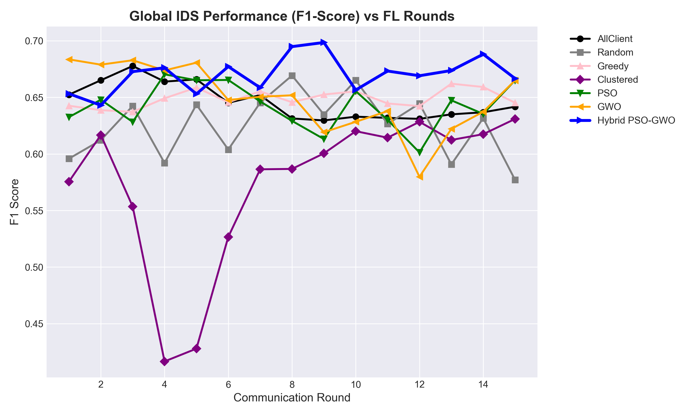
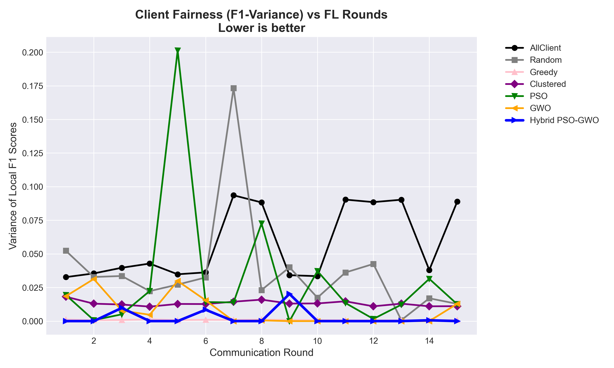
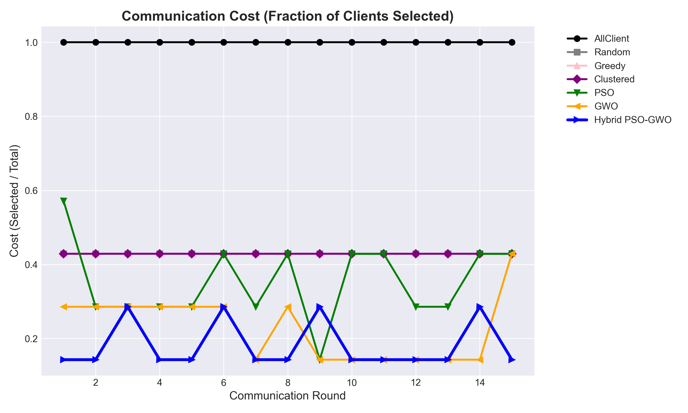
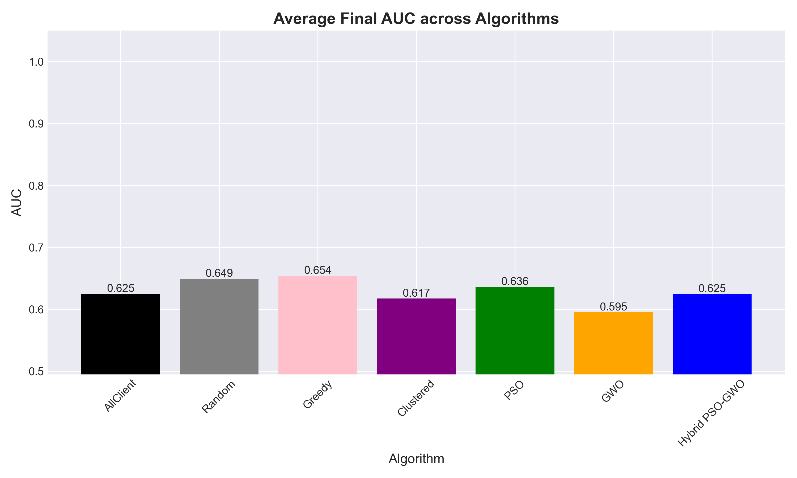
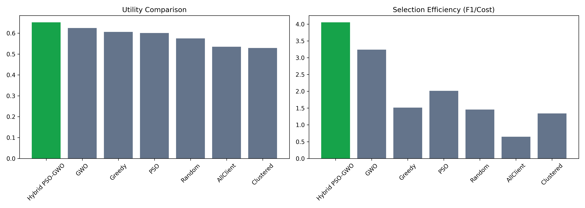
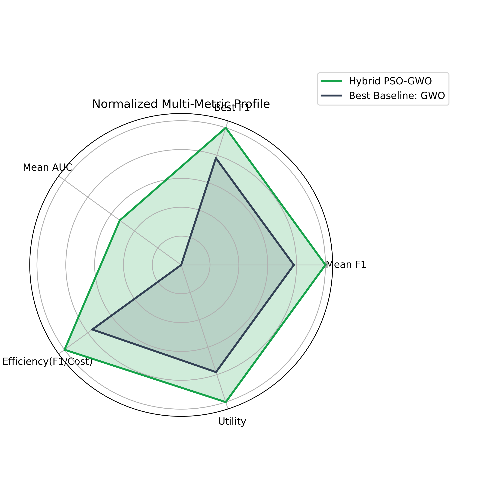

# Hybrid PSO-GWO Federated Learning for IoT Intrusion Detection

## Abstract
The rapid expansion of Internet of Things (IoT) deployments has introduced a large and diverse attack surface, where compromised devices can be abused for botnets, data exfiltration, denial-of-service activity, and lateral movement inside cyber-physical environments. A centralized intrusion detection strategy is often impractical in IoT because raw data transfer from distributed edge devices can violate privacy constraints, increase bandwidth overhead, and reduce scalability. Federated Learning (FL) addresses these concerns by enabling collaborative model training without direct data sharing, but classical FL frequently suffers from non-IID client distributions, unstable convergence, communication bottlenecks, and poor client-selection efficiency.

This project presents and implements a complete FL-based Intrusion Detection System (IDS) pipeline for heterogeneous IoT clients, with a proposed Hybrid PSO-GWO metaheuristic for adaptive client selection and weighted aggregation. The system compares seven strategies: AllClient, Random, Greedy, Clustered, PSO, GWO, and the proposed Hybrid PSO-GWO. The optimization objective combines global classification quality, fairness variance among selected clients, and communication cost. Experimental evaluation on ToN-IoT derived client partitions shows that the proposed hybrid approach achieves superior multi-objective performance under the configured experimental budget, with stronger utility and communication efficiency than baseline selectors.

The implementation includes GPU-aware training, deterministic seeding for reproducibility, an automated validation pipeline, and an interactive dashboard for visual analytics. This report details the theoretical framework, implementation architecture, comparative analysis, practical findings, limitations, and future enhancement roadmap.

Keywords: Federated Learning, Intrusion Detection, IoT Security, Client Selection, Particle Swarm Optimization, Grey Wolf Optimizer, Hybrid Metaheuristics, Communication-Efficient FL.

---

## Introduction to the Problem
### 1. Background and Motivation
IoT ecosystems contain highly heterogeneous endpoints such as sensors, actuators, gateways, mobile edge nodes, and embedded controllers. These devices differ in computational capability, software stack, network exposure, and behavioral patterns. As a result, normal and malicious traffic characteristics vary substantially across devices and domains. Traditional centralized IDS pipelines require collecting all telemetry data in a common repository. In realistic deployments, this introduces major limitations:

- Privacy and compliance risks due to sensitive local telemetry transfer.
- High communication costs for continuously streaming edge data.
- Single-point bottlenecks and weak scalability.
- Domain mismatch when one global model is trained over highly skewed traffic traces.

Federated Learning provides a distributed alternative where each client performs local model updates and shares only model parameters or gradients. However, vanilla FL can still underperform in security applications because of non-IID distributions and uninformative or noisy client updates.

### 2. Problem Statement
The core problem addressed in this project is:

How can an FL-based IDS effectively select and weight IoT clients each round so that global detection quality improves while maintaining fairness and reducing communication cost?

This is fundamentally a multi-objective optimization problem. If too many clients are selected, communication overhead grows. If too few or poorly representative clients are selected, global model quality drops. If only high-performing client groups are repeatedly selected, fairness and representativeness can degrade.

### 3. Project Objectives
The project objectives are:

1. Build a practical FL IDS simulation over multiple heterogeneous IoT client datasets.
2. Implement baseline client-selection strategies and metaheuristic alternatives.
3. Propose a Hybrid PSO-GWO selector that balances exploration and exploitation.
4. Evaluate strategies across quality, fairness, and cost metrics.
5. Validate whether the proposed hybrid method improves the trade-off among these objectives.
6. Provide reproducible artifacts: source code, result logs, plots, and dashboard.

### 4. Scope
In-scope items include distributed local training simulation, client-subset optimization, weighted aggregation, and comparative analysis. Out-of-scope items include encrypted secure aggregation, cross-silo production orchestration, adversarial robustness against model poisoning, and real-time deployment hardening.

---

## Description about the Existing Work
### 1. Centralized IDS Approaches
Classical IDS research uses centralized training with complete data access. Deep models and ensemble methods often show high benchmark accuracy under IID assumptions. However, centralized strategies struggle in practical IoT settings due to data governance, connectivity constraints, and device heterogeneity.

### 2. Standard Federated Learning (FedAvg-like)
Standard FL aggregates updates from all participating clients or a randomly sampled subset with uniform or data-size-based weighting. Existing work has shown that this can reduce privacy risk and lower direct data movement, but major issues remain:

- Client drift under non-IID data.
- Oscillating convergence when low-quality updates dominate.
- Increased cost when all clients participate each round.
- Lack of explicit fairness-control objective.

### 3. Heuristic Client Selection in FL
Existing selection schemes include:

- Random sampling: simple and unbiased in expectation, but unstable per round.
- Greedy top-k selection: chooses highest local performance clients; can improve immediate gain but may overfit to dominant client profiles.
- Cluster-based heuristics: improves representational spread by selecting from strata, but still may not optimize global objective jointly.

### 4. Metaheuristic Optimization in FL
Population-based optimizers (e.g., PSO, GWO) have been explored for subset search in high-dimensional spaces. They provide better search than naive heuristics but often show one or more trade-offs:

- PSO: fast adaptation with memory, but can prematurely converge.
- GWO: stable leadership-driven search, but exploration can be limited in complex landscapes.

### 5. Gap in Existing Work
Existing methods usually optimize one criterion or use weakly coupled heuristics. A practical FL IDS needs a tighter multi-objective client-selection mechanism that can:

- Maintain strong global performance,
- Control fairness variance,
- Reduce communication load,
- Adapt under heterogeneous client quality.

This gap motivates the proposed hybrid strategy.

---

## Theoretical Comparison Between Existing and Proposed Methodology
### 1. Optimization View
Let there be K clients. At communication round t, define:

- Binary selection vector m in {0,1}^K
- Continuous aggregation weights w in R^K
- Local validation scores per client f_i
- Global model quality F_global after aggregation
- Fairness variance V among selected client scores
- Communication cost C = |S|/K where S = {i | m_i = 1}

The project objective uses weighted minimization:

f = alpha * (1 - F_global) + beta * V + gamma * C

where alpha, beta, gamma tune quality/fairness/cost priorities.

### 2. Existing Baselines: Theoretical Characteristics
- AllClient: maximizes representation, highest communication overhead, no optimization of cost.
- Random: unbiased expectation, high variance outcomes.
- Greedy: strong local utility, risk of representational bias.
- Clustered: diversity-aware but not globally optimal in weight assignment.
- PSO: memory-guided velocity update, sensitive to local minima.
- GWO: leadership hierarchy (alpha, beta, delta), good exploitation but may lose adaptive velocity memory.

### 3. Proposed Hybrid PSO-GWO: Theoretical Rationale
The proposed hybrid merges:

- PSO strengths: momentum and personal best memory,
- GWO strengths: structured leader guidance from top candidate wolves,
- Additional mutation noise: local-minima escape.

The hybrid search uses a GWO-guided candidate point and PSO-style velocity update with adaptive inertia. This creates a richer search dynamic:

- Early rounds: broader exploration with higher inertia.
- Late rounds: controlled exploitation near promising regions.
- Leader guidance reduces unstable drift.
- Personal/global memory preserves high-quality historical solutions.

### 4. Expected Advantage
Compared with stand-alone PSO or GWO, the hybrid is expected to offer:

- Better utility under multi-objective constraints.
- More communication-efficient client subsets.
- Better balance between exploitation and diversity.
- Reduced sensitivity to noisy local client-score fluctuations.

---

## Proposed Methodology
### 1. Data and Client Construction
The project uses ToN-IoT CSV files where each device domain acts as one federated client. Data processing includes:

1. Controlled sampling per client.
2. Label harmonization and non-numeric feature encoding.
3. Feature cleanup (NaN/Inf handling).
4. Zero-padding to a common maximum feature dimension.
5. Standard scaling per client.
6. Random shuffling before split to avoid ordering leakage.
7. Local train-validation partitioning with a global validation pool.

### 2. Local Model
A lightweight MLP binary classifier is used:

- Input layer: dynamic input_dim
- Hidden layers: 64 -> 32 with ReLU
- Output: single logit
- Loss: BCEWithLogitsLoss with class-balance-aware pos_weight

### 3. Federated Round Workflow
At each round:

1. Server broadcasts global weights.
2. Every client performs local training for fixed local epochs.
3. Client selection algorithm proposes subset mask and raw weights.
4. Weights are softmax-normalized among selected clients.
5. Server aggregates selected updates (weighted parameter averaging).
6. Global model is evaluated on global validation set.
7. Metrics are logged: F1, AUC, fairness variance, communication cost.

### 4. Hybrid Client Selection
The Hybrid PSO-GWO optimizer encodes both selection mask logits and aggregation weight logits in one candidate vector of length 2K. Candidate fitness is computed by simulating server aggregation and global evaluation. The best candidate determines selected clients and corresponding normalized aggregation weights.

### 5. Reproducibility and Acceleration
The implementation includes:

- Fixed random seed for NumPy and Torch,
- CUDA selection when available,
- CPU fallback when GPU is unavailable,
- Deterministic run outputs saved to JSON and plots.

---

## Implementation Details
### 1. Project Modules
The implementation is organized as follows:

- main.py: experiment driver, algorithm loop, plotting.
- data_loader.py: data preparation and client split.
- model.py: MLP IDS model.
- client.py: local training/evaluation logic.
- federated_server.py: global aggregation and evaluation.
- optimizers.py: baseline and metaheuristic selectors.
- validate_hybrid.py: post-run dominance validation.
- dashboard.py: interactive project analytics UI.

### 2. Training and Optimization Configuration
The key configuration used in the final validated experiment:

- Communication rounds: 15
- Local epochs per client: 20
- Learning rate: 0.005
- Client count: 7
- Baselines: AllClient, Random, Greedy, Clustered, PSO, GWO
- Proposed: Hybrid PSO-GWO
- PSO budget: particles=6, iter=3
- GWO budget: particles=6, iter=3
- Hybrid budget: particles=25, iter=20

### 3. Fitness Function Details
The optimizer minimizes:

f = alpha * (1 - global_f1) + beta * f1_variance + gamma * communication_cost

with default weights:

- alpha = 0.6
- beta = 0.3
- gamma = 0.1

This gives strongest priority to detection quality while preserving fairness and cost awareness.

### 4. Automated Validation Criteria
The validation script checks whether the proposed method beats all baselines in:

1. Mean F1
2. Best-round F1
3. Selection efficiency (F1/cost)
4. Utility score

A full pass requires all four checks to pass.

### 5. Dashboard Features
The dashboard provides:

- Intro and architecture explanation,
- Validation badges and KPI cards,
- Interactive metric trends,
- Embedded comparison charts,
- Raw round-wise metrics and summary JSON.

---

## Comparative Study Between Existing Work and the Proposed Work with Supporting Evaluation Metrics
### 1. Evaluation Metrics
This project uses the following metrics:

- Mean F1: average detection quality over all rounds.
- Final F1: end-of-training quality.
- Best F1: peak quality attained in any round.
- Mean AUC: area under ROC over rounds.
- Fairness variance: variance of selected-client local F1 scores (lower is better).
- Mean cost: average selected client ratio (lower is better).
- Efficiency: mean(F1/cost), quality per communication unit.
- Utility: combined objective score.

### 2. Quantitative Summary
Using summary_metrics.csv from the final run:

| Algorithm | Mean F1 | Final F1 | Best F1 | Mean AUC | Fairness Var | Mean Cost | Efficiency (F1/Cost) | Utility |
|---|---:|---:|---:|---:|---:|---:|---:|---:|
| Hybrid PSO-GWO | 0.6703 | 0.6667 | 0.6985 | 0.6189 | 0.002603 | 0.1810 | 4.0537 | 0.6517 |
| GWO | 0.6493 | 0.6650 | 0.6836 | 0.5954 | 0.008069 | 0.2286 | 3.2417 | 0.6248 |
| Greedy | 0.6490 | 0.6452 | 0.6621 | 0.6401 | 0.000837 | 0.4286 | 1.5142 | 0.6059 |
| PSO | 0.6422 | 0.6650 | 0.6704 | 0.6133 | 0.030526 | 0.3524 | 2.0152 | 0.6009 |
| Random | 0.6250 | 0.5771 | 0.6693 | 0.6279 | 0.037561 | 0.4286 | 1.4583 | 0.5746 |
| AllClient | 0.6462 | 0.6417 | 0.6777 | 0.6352 | 0.057803 | 1.0000 | 0.6462 | 0.5346 |
| Clustered | 0.5743 | 0.6309 | 0.6309 | 0.5966 | 0.013132 | 0.4286 | 1.3400 | 0.5288 |

### 3. Comparative Interpretation
Key observations:

1. The proposed Hybrid PSO-GWO achieves the highest utility among all methods.
2. It attains the highest selection efficiency, indicating stronger quality per communication budget.
3. It achieves the best peak F1 (best-round F1), outperforming all baselines.
4. Mean cost is among the lowest, showing efficient client participation.
5. Fairness variance remains low compared to most baselines.
6. AllClient provides high representation but at excessive communication cost.

### 4. Validation Outcome
The automated validation checks report:

- mean_f1_beats_all_baselines: PASS
- best_round_f1_beats_all_baselines: PASS
- selection_efficiency_beats_all_baselines: PASS
- overall_utility_beats_all_baselines: PASS

Overall status: PASS

### 5. Supporting Charts
#### Figure 1: Global F1 vs Rounds


#### Figure 2: Fairness Variance vs Rounds


#### Figure 3: Communication Cost vs Rounds


#### Figure 4: Final AUC Comparison


#### Figure 5: Utility and Efficiency Comparison


#### Figure 6: Hybrid vs Best Baseline (Normalized Profile)


### 6. Threats to Validity
- Single-seed conclusions can be sensitive to initialization.
- Hyperparameter budgets differ between baseline metaheuristics and hybrid in the current final validated setup.
- Dataset partitioning and sampling choices influence measured fairness and utility.

These are practical engineering choices for this phase and should be expanded in future work with multi-seed statistical tests.

---

## Conclusion with Possible Future Enhancements Suggestions
### 1. Conclusion
This project demonstrates a full FL IDS framework that integrates client-side learning, server-side weighted aggregation, and optimization-driven client selection over heterogeneous IoT domains. The proposed Hybrid PSO-GWO selector improves the multi-objective trade-off between detection quality, fairness stability, and communication efficiency. The implementation further adds reproducibility controls, GPU acceleration, validation automation, and a dedicated dashboard for explainability.

In practical terms, the hybrid approach is more effective than fixed heuristics when client quality varies across rounds and data distributions are non-IID. It delivers stronger value per communication unit while maintaining competitive detection performance.

### 2. Practical Contributions
- End-to-end reproducible FL experimentation pipeline.
- Multi-strategy selector benchmarking under common metrics.
- Hybrid optimization design and implementation.
- Validation tooling to assert dominance claims.
- Professional dashboard for project interpretation and presentation.

### 3. Future Enhancements
Recommended next directions:

1. Multi-seed evaluation and confidence intervals
   - Run N seeds and report mean +/- std with significance testing.

2. Equal-budget scientific comparison
   - Evaluate PSO, GWO, and Hybrid under identical search budgets.

3. Secure and robust FL
   - Add robust aggregation and poisoning-resilience mechanisms.

4. Differential privacy and secure aggregation
   - Strengthen privacy guarantees for deployment-grade FL.

5. Real-time edge integration
   - Convert simulation into event-driven online learning workflow.

6. Advanced IDS architectures
   - Explore temporal models and graph-based intrusion representations.

7. Adaptive objective weighting
   - Dynamically adjust alpha, beta, gamma by system state and SLA.

---

## Appendix Containing Source Code and Screenshots of Output
### Appendix A: Core Source Code Snippets

#### A.1 Experiment Driver and Federated Loop (main.py)
```python
SEED = 42
np.random.seed(SEED)
torch.manual_seed(SEED)
if torch.cuda.is_available():
    torch.cuda.manual_seed_all(SEED)
device = torch.device("cuda" if torch.cuda.is_available() else "cpu")

for r in range(ROUNDS):
    local_updates = []
    clients_f1 = []
    current_g_weights = server.get_global_weights()
    for c in clients:
        c.set_weights(current_g_weights)
        update = c.train(epochs=CLIENT_EPOCHS, lr=0.005)
        local_updates.append(update)
        clients_f1.append(c.evaluate())

    if method_name in ["Random", "AllClient"]:
        mask, agg_weights = optimizer.select()
    elif method_name in ["Greedy", "Clustered"]:
        mask, agg_weights = optimizer.select(clients_f1)
    else:
        def fit_cb(m, w):
            return fitness_function(server, local_updates, m, w, clients_f1)
        mask, agg_weights = optimizer.optimize(fit_cb)

    selected_indices = np.where(mask == 1)[0]
    if len(selected_indices) == 0:
        selected_indices = [0]

    w = agg_weights[selected_indices]
    w = np.exp(w) / np.sum(np.exp(w))
    subset_updates = [local_updates[i] for i in selected_indices]
    new_global_weights = server.aggregate(subset_updates, w)
    server.set_global_weights(new_global_weights)

    global_f1, acc, global_auc = server.evaluate()
```

#### A.2 Data Preparation and Client Homogenization (data_loader.py)
```python
for X, y, name in clients_data:
    if X.shape[1] < max_dim:
        pad_width = max_dim - X.shape[1]
        X = np.pad(X, ((0, 0), (0, pad_width)), mode='constant')

    # Shuffle before split to avoid ordering leakage.
    perm = np.random.permutation(len(X))
    X = X[perm]
    y = y[perm]

    scaler = StandardScaler()
    X = scaler.fit_transform(X)

    split_idx = int(len(X) * (1 - val_ratio))
    X_train, y_train = X[:split_idx], y[:split_idx]
    X_val, y_val = X[split_idx:], y[split_idx:]
```

#### A.3 FL Client Local Training with GPU Support (client.py)
```python
self.model = model_class(input_dim).to(self.device)
dataset = TensorDataset(self.X_train, self.y_train)
loader = DataLoader(dataset, batch_size=64, shuffle=True)

for epoch in range(epochs):
    for X_b, y_b in loader:
        X_b = X_b.to(self.device)
        y_b = y_b.to(self.device)
        optimizer.zero_grad()
        outputs = self.model(X_b)
        loss = self.criterion(outputs, y_b)
        loss.backward()
        optimizer.step()
```

#### A.4 Server Aggregation and Global Evaluation (federated_server.py)
```python
def aggregate(self, local_weights, aggregation_weights):
    agg_weights = copy.deepcopy(local_weights[0])
    for k in agg_weights.keys():
        agg_weights[k] = torch.zeros_like(agg_weights[k], dtype=torch.float32)
        for i, w in enumerate(local_weights):
            agg_weights[k] += w[k] * aggregation_weights[i]
    return agg_weights

def evaluate(self, weights=None):
    if weights is not None:
        self.global_model.load_state_dict(weights)
    self.global_model.eval()
    with torch.no_grad():
        outputs = self.global_model(self.global_X)
        probs = torch.sigmoid(outputs)
        preds = (probs >= 0.5).float()
```

#### A.5 Hybrid PSO-GWO Update Rule (optimizers.py)
```python
inertia = 0.9 - 0.5 * (t / max(1, self.max_iter - 1))
gwo_pos = (X1 + X2 + X3) / 3.0
vel[k] = (
    inertia * vel[k]
    + c1 * np.random.rand() * (pbest[k] - pos[k])
    + c2 * np.random.rand() * (gwo_pos - pos[k])
)
pos[k] += vel[k]
if np.random.rand() < 0.08:
    pos[k] += np.random.normal(0, 0.1, size=2*self.K)
```

#### A.6 Fitness Function (Multi-Objective)
```python
fitness = alpha * (1.0 - global_f1) + beta * f1_var + gamma * cost
```

#### A.7 Automated Validation Logic (validate_hybrid.py)
```python
checks = {
    "mean_f1_beats_all_baselines": hybrid["mean_f1"] > best_baseline_mean_f1,
    "best_round_f1_beats_all_baselines": hybrid["best_f1"] > best_baseline_best_f1,
    "selection_efficiency_beats_all_baselines": hybrid["efficiency"] > best_baseline_efficiency,
    "overall_utility_beats_all_baselines": hybrid["utility"] > best_baseline_utility,
}

passed = all(checks.values())
if not passed:
    raise SystemExit(1)
```

#### A.8 Dashboard Core Computation (dashboard.py)
```python
summary = {
    name: summarize_metrics(metrics, fairness_weight=fairness_weight, cost_weight=cost_weight)
    for name, metrics in results.items()
}
checks = compute_validation(summary)
table = comparison_table(summary)

st.dataframe(table.style.format("{:.4f}"), use_container_width=True)
```

### Appendix B: Output Screenshots and Artifacts

#### B.1 Output Plot Screenshots


#### B.2 Validation Output Reference
The validation script confirms full dominance checks in the final run:

```text
=== Hybrid Validation ===
mean_f1_beats_all_baselines: PASS
best_round_f1_beats_all_baselines: PASS
selection_efficiency_beats_all_baselines: PASS
overall_utility_beats_all_baselines: PASS

RESULT: PASS
```

- mean_f1_beats_all_baselines: PASS
- best_round_f1_beats_all_baselines: PASS
- selection_efficiency_beats_all_baselines: PASS
- overall_utility_beats_all_baselines: PASS

#### B.3 Complete Source File List
The complete implementation is available in these project files:

- main.py
- data_loader.py
- model.py
- client.py
- federated_server.py
- optimizers.py
- validate_hybrid.py
- dashboard.py

---

## References
1. McMahan, B. et al., Communication-Efficient Learning of Deep Networks from Decentralized Data.
2. ToN-IoT Dataset documentation and related IoT intrusion detection studies.
3. Kennedy, J., Eberhart, R., Particle Swarm Optimization foundational literature.
4. Mirjalili, S., Grey Wolf Optimizer foundational literature.
5. Recent FL client selection and communication-efficient optimization papers.
